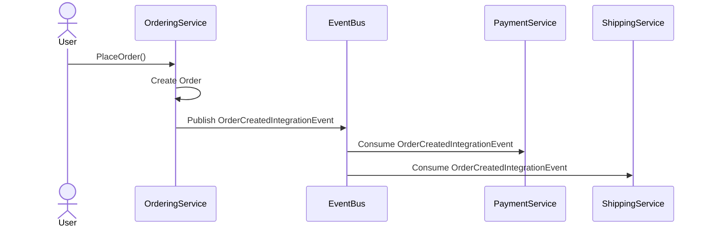

# PRN232-Group-Assignment

This is a personal project to learn microservices and use new technologies

Goals:

- Develop a ecommerse web with multiple microservices backends
- Use multiple Db both SQL and NoSQL
- Microservices communicate via RabbitMQ messages

## _Note_

Cons (tobe fixed in the future?):

- Business rule is tight(for learning purposes)
- Basket's quantity validation is FE based
  - Customer have to re-try checking order's stock validation manually
- Update game haven't been sync via Rabbit MQ
- The project don't have a source of truth. Thus race condition and data lose. Have not found a solution
  - After done `docker compose up -d` for the first time. Delete ordering's and airwaterstore's db due to race condition when seeding.
    - Then rerun air water store docker compose
  - If faced with race condition when seeding database:
    - Keep the table schema
    - Delete the db record
    - Rerun docker compose

## _Test account_

- User:
  - Email: <user@gmail.com>
  - Password: 123456As!
- Staff:
  - Email: <staff@gmail.com>
  - Password: 123456As!

