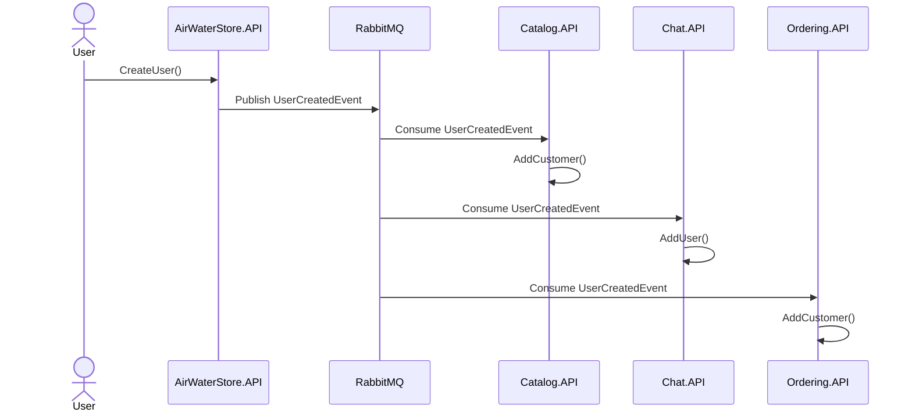
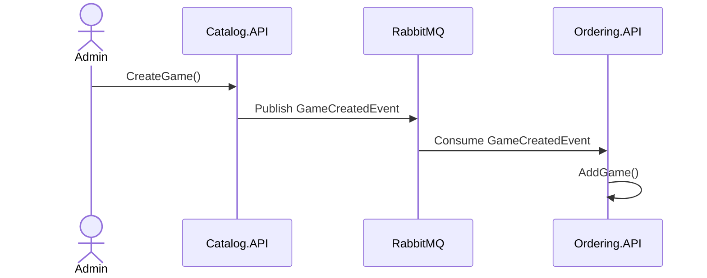
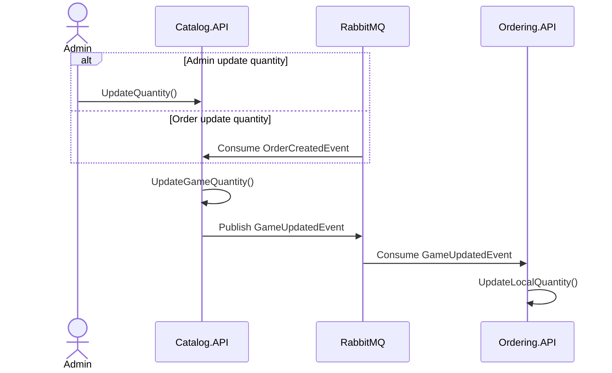
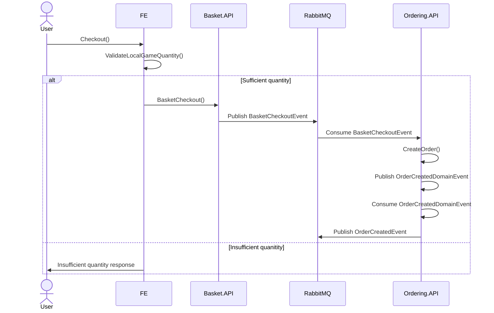

# AirWaterStore Documentation

This document is for understanding overall structure and is not qualified for a SRS or SAS

## I. Overview

### 1. User Requirements

#### 1.1. Actors

#### 1.2. Use Cases

##### a. Diagram

##### b. Descriptions

### 2. Overall Functionalities

#### 2.1. Screens Flow

#### 2.2. Screen Description

#### 2.3. Screen Authorization

### 3. System High Level Design

### 3.1 Database Design

#### a. AirWaterStore

#### b. Catalog

#### c. Basket

#### d. Discount

#### e. Orderring

#### f. Chat

### 3.2 Code Packages

### 3.3 Integration Events

#### 1. UserCreated

#### 2. GameCreated

#### 3. GameUpdated

#### 4. OrderCreated

## II. Sequence Diagrams
